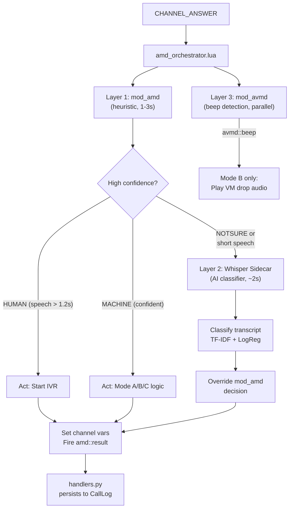

# Three-Layer Parallel AMD System — Implementation Walkthrough

## Overview

A production-grade 3-layer parallel answering machine detection system that minimizes false positives and optimizes for per-second SIP billing.

## Architecture



## Campaign Mode Behavior Matrix

| Event | Mode A | Mode B | Mode C |
|---|---|---|---|
| **HUMAN** | Continue IVR | Continue IVR | Continue IVR |
| **MACHINE** | Hangup immediately | Keep avmd, wait for beep | Hangup immediately |
| **avmd::beep** | — | Play vm_drop_audio → hangup | — |
| **UNKNOWN** | Hangup | Hangup | Continue IVR (safe) |

## Files Created / Modified

### New Files (9)

| File | Purpose |
|---|---|
| [Dockerfile](file:///c:/Users/Modmin/Desktop/broadcaster/freeswitch/Dockerfile) | Custom FreeSWITCH image with mod_amd compiled from source (pinned to `bytedesk/freeswitch:latest` - Ubuntu 22.04 base) |
| [amd.conf.xml](file:///c:/Users/Modmin/Desktop/broadcaster/freeswitch/conf/autoload_configs/amd.conf.xml) | mod_amd config, every parameter commented with tradeoffs |
| [amd_orchestrator.lua](file:///c:/Users/Modmin/Desktop/broadcaster/freeswitch/scripts/amd_orchestrator.lua) | 3-layer orchestration engine (replaces `amd.lua`) |
| [whisper-amd/Dockerfile](file:///c:/Users/Modmin/Desktop/broadcaster/whisper-amd/Dockerfile) | Whisper sidecar Docker image (Python 3.11, CPU-only) |
| [whisper-amd/server.py](file:///c:/Users/Modmin/Desktop/broadcaster/whisper-amd/server.py) | WebSocket AMD server (faster-whisper INT8 + classifier) |
| [whisper-amd/classifier.py](file:///c:/Users/Modmin/Desktop/broadcaster/whisper-amd/classifier.py) | TF-IDF + LogReg classifier with rule-based fallback |
| [whisper-amd/requirements.txt](file:///c:/Users/Modmin/Desktop/broadcaster/whisper-amd/requirements.txt) | Python deps (faster-whisper, scikit-learn, etc.) |
| [whisper-amd/models/README.md](file:///c:/Users/Modmin/Desktop/broadcaster/whisper-amd/models/README.md) | Instructions for training custom classifier |
| [migration](file:///c:/Users/Modmin/Desktop/broadcaster/backend/alembic/versions/a3f1e8d92b47_add_campaign_mode_amd_fields.py) | Alembic migration for campaign_mode + AMD telemetry |

### Modified Files (9)

| File | Changes |
|---|---|
| [docker-compose.yml](file:///c:/Users/Modmin/Desktop/broadcaster/docker-compose.yml) | FS `build:` instead of `image:`, mod_amd/avmd healthcheck, new `whisper-amd` service |
| [modules.conf.xml](file:///c:/Users/Modmin/Desktop/broadcaster/freeswitch/conf/autoload_configs/modules.conf.xml) | Load `mod_amd` + `mod_avmd` |
| [avmd.conf.xml](file:///c:/Users/Modmin/Desktop/broadcaster/freeswitch/conf/autoload_configs/avmd.conf.xml) | Reduced `detectors_n` 36→18 for CPU savings |
| [core.py](file:///c:/Users/Modmin/Desktop/broadcaster/backend/app/models/core.py) | `CampaignMode` enum, `campaign_mode`+`vm_drop_audio_id` on Campaign, AMD telemetry on CallLog |
| [config.py](file:///c:/Users/Modmin/Desktop/broadcaster/backend/app/core/config.py) | Whisper sidecar connection settings |
| [dialer.py](file:///c:/Users/Modmin/Desktop/broadcaster/backend/app/engine/dialer.py) | Pass `campaign_mode` + `vm_drop_audio_id` as channel vars |
| [handlers.py](file:///c:/Users/Modmin/Desktop/broadcaster/backend/app/engine/handlers.py) | New `amd::result`, `amd::whisper_request`, `avmd::beep` handlers + AMD telemetry CDR |
| [campaigns.py](file:///c:/Users/Modmin/Desktop/broadcaster/backend/app/api/v1/campaigns.py) | `GET /campaigns/{id}/amd-stats` endpoint |
| [campaign.py](file:///c:/Users/Modmin/Desktop/broadcaster/backend/app/schemas/campaign.py) | `campaign_mode` + `vm_drop_audio_id` fields in schemas |

## Smart Routing Logic

Only ~30-40% of calls hit the Whisper sidecar. Layer 2 is invoked when:
1. **mod_amd returned NOTSURE/UNKNOWN** — can't decide
2. **mod_amd returned HUMAN but speech was < 1.2 seconds** — catches the "Hello?" false positive that kills accuracy on voicemails that open with a name/greeting before the recorded message

## Deployment Steps

```bash
# 1. Build the custom FreeSWITCH image (compiles mod_amd from source)
docker compose build freeswitch

# 2. Build the Whisper AMD sidecar
docker compose build whisper-amd

# 3. Start infrastructure
docker compose up -d postgres redis freeswitch whisper-amd

# 4. Run the database migration  
cd backend && alembic upgrade head

# 5. Verify AMD modules loaded
docker exec broadcaster-freeswitch-1 fs_cli -x "module_exists mod_amd"
# → true
docker exec broadcaster-freeswitch-1 fs_cli -x "module_exists mod_avmd"
# → true

# 6. Verify Whisper sidecar health
curl http://localhost:8080/healthz
# → {"status": "ok", "model_size": "small", "device": "cpu"}

# 7. Start backend + frontend
# (backend will auto-connect ESL and register event handlers)
```

## AMD Stats API

```
GET /api/v1/campaigns/{id}/amd-stats
```

Response:
```json
{
  "total_calls": 1500,
  "human_pct": 62.4,
  "machine_pct": 31.2,
  "unknown_pct": 6.4,
  "avg_decision_ms": 1847,
  "layer_breakdown": { "mod_amd": 1020, "whisper": 430, "timeout": 50 },
  "mode_breakdown": { "A": 1500, "B": 0, "C": 0 }
}
```
