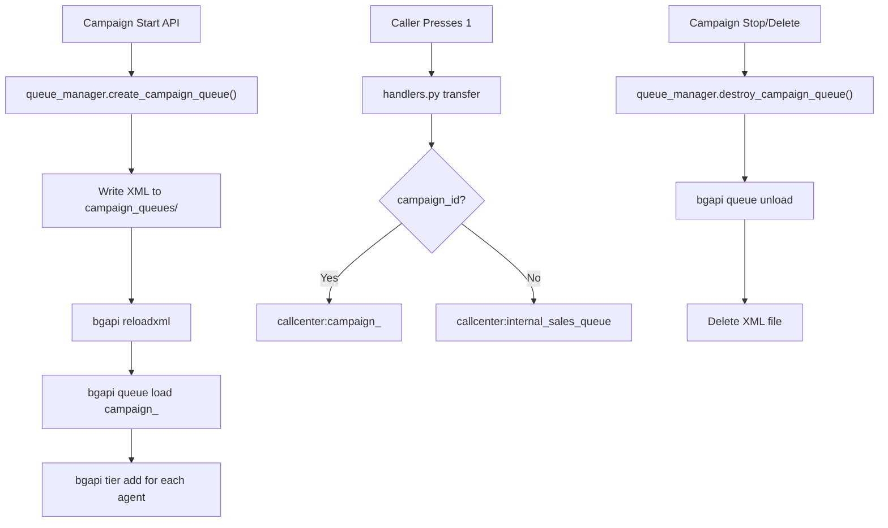

# Campaign Queue Orchestration — Final State

## Architecture



## Key Bugs Found & Fixed

### 1. Genesis Queue Poisoning (Critical)

**Root Cause**: Genesis library's `Protocol.send()` pops command responses from an unbounded `asyncio.Queue` (`self.commands`). The ESL pool's long-lived connections accumulate stale `command/reply` and `api/response` events from previous cancelled/timed-out operations. When `api()` is called, `commands.get()` instantly returns a **stale response** instead of waiting for the real one.

**Impact**: All foreground `api()` calls in the agent sync were returning wrong data. `sofia_contact` check was reading a stale `+OK` response → all agents incorrectly marked Available.

**Fix**: Raw TCP ESL client for startup sync — implements minimal ESL protocol via `asyncio.open_connection()` with inline response reading. No Genesis, no queue, no background tasks.

### 2. mod_callcenter Multi-Word Status Bug

**Root Cause**: mod_callcenter's API argument parser uses `switch_separate_string()` which splits on spaces. Multi-word statuses (`Logged Out`, `On Break`) get split into two args → `-ERR Invalid Agent Status!`.

**Fix**: Delete + re-add agent (defaults to `Logged Out`). Only set `Available` for registered agents. Unregistered agents keep the default `Logged Out`.

### 3. Docker Volume Mount vs Baked Image

**Root Cause**: Backend Python code is baked into the Docker image at build time (at `/app/app/`). The `docker-compose.yml` only mounts audio, CSV, and FreeSWitch config — NOT the backend source. Copying files to `/opt/IVR1/backend/` only updates the host filesystem.

**Fix**: Use `docker cp` to inject files directly into the running container's filesystem.

## Files Modified

| File | Changes |
|------|---------|
| `backend/app/main.py` | Raw TCP ESL client for agent sync; delete+add status reset |
| `backend/app/engine/queue_manager.py` | All commands use `bgapi()` to avoid queue poisoning |
| `backend/app/engine/handlers.py` | Routes transfers to campaign-specific queues |
| `backend/app/api/v1/campaigns.py` | Queue lifecycle hooks on start/stop/delete |
| `freeswitch/conf/autoload_configs/callcenter.conf.xml` | Include directive for campaign_queues/ |
| `install.sh` | Phase 3.5 fail2ban auto-setup + post-deploy activation |

## Production Verification

```
Agent 1001: not registered → Logged Out ✅
Agent 3001: registered → Available ✅
Agent 3002: registered → Available ✅
Agent 3003: not registered → Logged Out ✅
Agent 3004: not registered → Logged Out ✅
Agent 3005: not registered → Logged Out ✅
Agent 3006: registered → Available ✅
Agent 2001: registered → Available ✅
```

## Deployment Procedure

```bash
# 1. Copy files to host
scp backend/app/main.py ubuntu@HOST:/tmp/

# 2. Inject into container (NOT host mount!)
sudo docker cp /tmp/main.py ivr1-backend-1:/app/app/main.py

# 3. Restart
sudo docker restart ivr1-backend-1
```

> [!WARNING]
> Never use `sudo cp /tmp/file /opt/IVR1/backend/app/file` — this only changes the host.
> The backend container's Python code lives at `/app/app/` inside the image.
